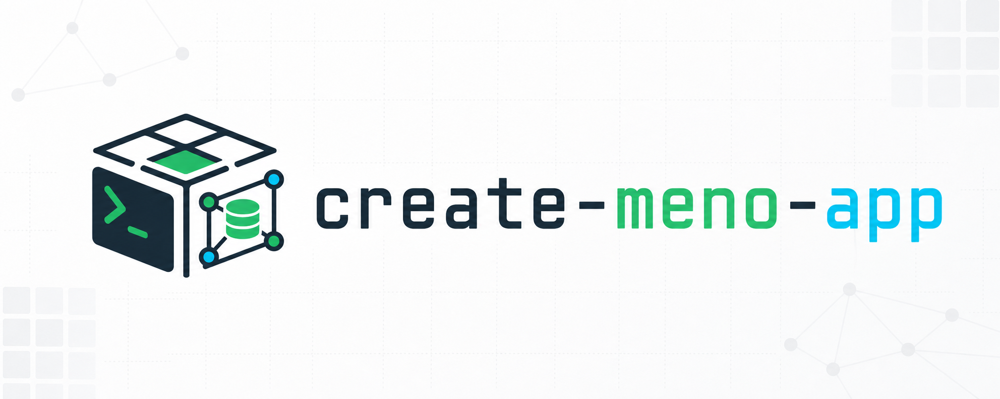
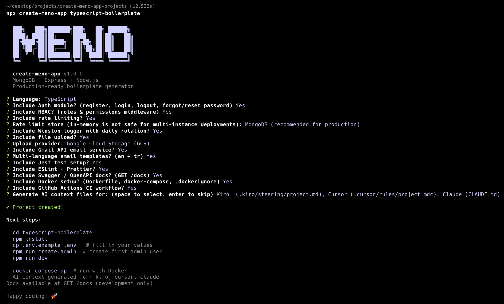

# create-meno-app

[](https://www.npmjs.com/package/create-meno-app)
[](https://www.npmjs.com/package/create-meno-app)
[](https://www.npmjs.com/package/create-meno-app)
[](LICENSE)

Production-ready **MongoDB · Express · Node.js** boilerplate generator.
Scaffold a full backend in seconds, not hours.

```bash
npx create-meno-app my-api
```

> 📦 [**create-meno-app** on npm](https://www.npmjs.com/package/create-meno-app)

[](assets/logo.png)
[](assets/cli.png)

## Features

| Feature                 | Details                                                                                                     |
| ----------------------- | ----------------------------------------------------------------------------------------------------------- |
| **Auto Route Loader**   | Drop a `*.routes.js` file → it's mounted automatically. Zero `app.use()` boilerplate.                       |
| **Auto Async Wrapping** | Controllers are plain async functions. The route loader wraps them — no `asyncHandler`, no manual wrapping. |
| **Config module**       | All `process.env` reads in one place. Missing vars throw at startup with a clear message.                   |
| **Request ID**          | Every request gets a `X-Request-ID` header for distributed tracing.                                         |
| **Graceful shutdown**   | SIGTERM/SIGINT handler — waits for in-flight requests, closes DB cleanly.                                   |
| **Health check**        | `GET /health` → `{ status, uptime, db, timestamp }` — ready for Docker & load balancers.                    |
| **Pagination utility**  | `paginate()` + `paginatedResponse()` → `{ items, total, page, limit, totalPages, hasNext, hasPrev }`        |
| **DB index sync**       | `ensureIndexes()` runs at startup — no silent missing indexes in production.                                |
| **Error codes**         | Centralised `ErrorCodes` constants — no magic strings.                                                      |
| **`meno generate`**     | Scaffold a new module (5 files) with one command.                                                           |

### Optional

| Option            | What it adds                                                                |
| ----------------- | --------------------------------------------------------------------------- |
| Auth module       | register, login, logout, forgot/reset password, change password             |
| Social sign-in    | Google & Apple via ID-token verification — one flow for web + mobile         |
| Gmail email       | Handlebars templates, multi-language (en + tr), welcome/forgot/reset emails |
| File upload       | Local disk (Multer) or Google Cloud Storage with signed URL cache           |
| Swagger docs      | `GET /docs` — OpenAPI UI, development only                                  |
| Markdown docs     | `npm run docs` → `docs/` — request/response auto-derived from Joi + code    |
| Jest              | MongoDB Memory Server test setup, auth tests included                       |
| ESLint + Prettier | Flat config ESLint, Prettier, Husky pre-commit hook, lint-staged            |
| Docker            | Dockerfile (multi-stage for TS), docker-compose with MongoDB, HEALTHCHECK   |
| GitHub Actions    | CI workflow (lint + test + build + docs check), Dependabot config           |
| AI context        | Project conventions for Kiro, Cursor, and/or Claude                         |

---

## Quick Start

```bash
npx create-meno-app my-api
cd my-api
npm install
cp .env.example .env
npm run dev
```

---

## Generated Project Structure

```
src/
├── config/
│   └── config.js              # Central env config
├── constants/
│   ├── error-codes.js
│   └── roles.js
├── middlewares/
│   ├── auth.middleware.js
│   ├── cors.middleware.js
│   ├── error.middleware.js
│   ├── ratelimit.middleware.js
│   ├── request-id.middleware.js
│   └── validation.middleware.js
├── models/                    # ALL Mongoose models live here
│   └── user.model.js
├── modules/                   # Auto-mounted feature modules
│   ├── auth/                  # → /auth
│   ├── example/               # → /example
│   └── health/                # → /health
├── utils/
│   ├── database.js
│   ├── db-indexes.js
│   ├── graceful-shutdown.js
│   ├── paginate.js
│   ├── path-loader.js
│   └── route-loader.js        # Auto-mounts routes + wraps async handlers
└── server.js

docs/                          # (Markdown docs option) generated by `npm run docs`
├── README.md  MODULES.md  MODELS.md
├── modules/                   # one page per module
└── models/                    # one page per model
```

> The `docs/` tree is produced by `npm run docs` (Markdown docs option) and meant
> to be committed. Optional features also add files under `src/` — e.g.
> `utils/swagger.<ext>`, `utils/doc-introspect.<ext>`, `scripts/generate-docs.<ext>`.

---

## Auto Route Loader

**You never write `app.use()` for modules.**

The route loader scans `src/modules/` at startup and mounts every
`<name>/<name>.routes.js` file automatically:

| File                                    | Mounted at |
| --------------------------------------- | ---------- |
| `src/modules/auth/auth.routes.js`       | `/auth`    |
| `src/modules/example/example.routes.js` | `/example` |
| `src/modules/product/product.routes.js` | `/product` |

**All async handlers are wrapped automatically.** Thrown errors and rejected
promises are forwarded to the Express error handler. No `asyncHandler` import,
no `wrapController`, no try/catch needed.

To opt out, add `// @no-auto-load` as the first line of the routes file.

---

## Controllers — Just Plain Async Functions

```js
// example.controller.js
import * as exampleService from './example.service.js';

export const list = async (req, res) => res.json(await exampleService.listExamples(req.query));
export const create = async (req, res) =>
  res.status(201).json(await exampleService.createExample(req.body));
```

```js
// example.routes.js — no wrapper imports, no manual wrapping
import express from 'express';
import * as ctrl from './example.controller.js';

const router = express.Router();
router.get('/', ctrl.list);
router.post('/', ctrl.create);
export default router;
```

That's it. The route loader handles async error forwarding automatically.

---

## meno generate

Scaffold a new module inside an existing project:

```bash
npm run generate product           # create all 5 files
npm run generate product --dry-run # preview without writing
npm run generate -- --list         # list existing modules
```

Generated files:

```
src/models/product.model.js
src/modules/product/product.validation.js
src/modules/product/product.service.js
src/modules/product/product.controller.js
src/modules/product/product.routes.js   ← auto-mounted at /product
```

---

## Pagination

```js
import { paginate, paginatedResponse } from '@/utils/paginate.js';

export const listProducts = async (query) => {
  const { page, limit, skip } = paginate(query);
  const [items, total] = await Promise.all([
    Product.find().skip(skip).limit(limit),
    Product.countDocuments(),
  ]);
  return paginatedResponse(items, total, page, limit);
};
// → { items, total, page, limit, totalPages, hasNext, hasPrev }
```

---

## Auto Docs (optional)

Enable the Markdown docs generator and run:

```bash
npm run docs            # writes docs/ (per-module + per-model pages)
npm run docs -- --check # CI guard: fails if committed docs/ is stale
```

It scans `src/modules/` and `src/models/` — no central registry. **Request bodies
and query params are derived from the Joi schemas** (`validateBody`/`validateQuery`)
and **response examples are inferred** from the controller → service → model chain,
so you normally write only `// @doc <summary>` (and an optional `// @desc`). Use
`// @body`, `// @query`, `// @response <code>` only to override. The same engine
(`src/utils/doc-introspect.js`, or `.ts` in TypeScript projects) also feeds the
Swagger UI, so `/docs` and `docs/` never drift. `npm run docs` also prunes pages
for removed modules/models. Commit `docs/` so AI assistants and humans get a
current API map.

---

## Version Freshness

Generated `package.json` files use **live versions** read from the CLI's own
`node_modules` — not hardcoded strings. Run `npm update` in the CLI directory
to keep generated projects on the latest versions.

---

## Contributing

See [CONTRIBUTING.md](./CONTRIBUTING.md).

## License

MIT
